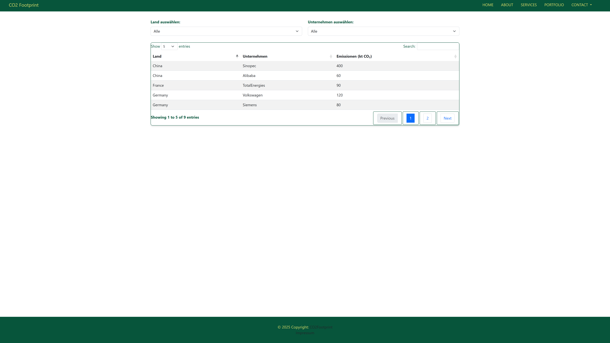
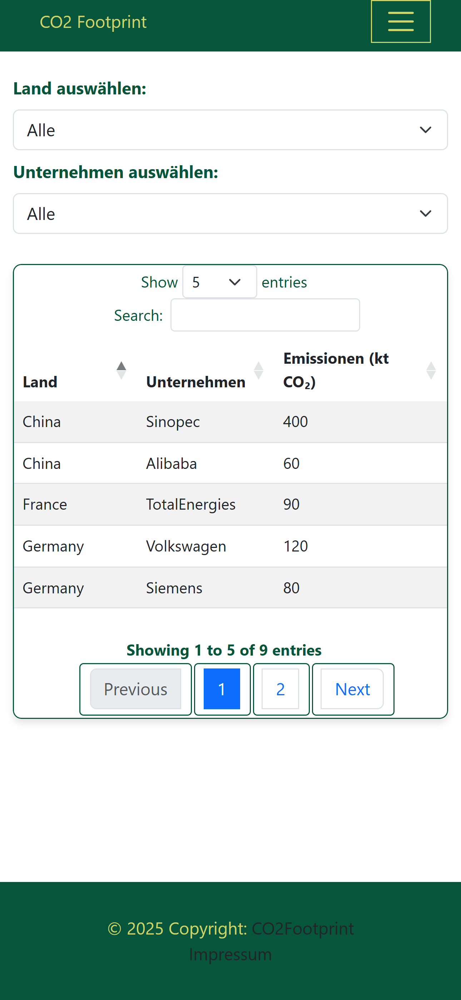
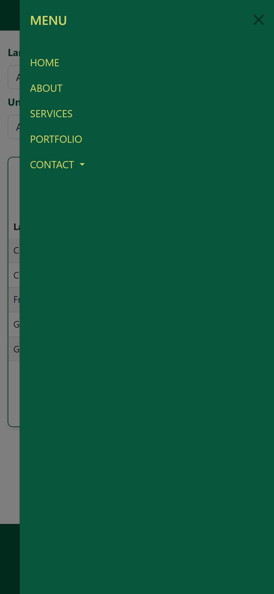
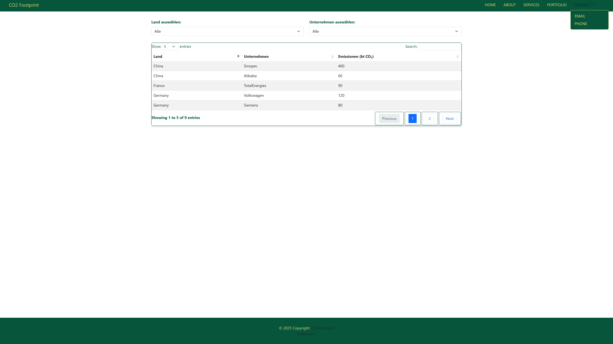

# CO2 Footprint — Interaktive Tabelle mit CO₂-Emissionen

**Kurzbeschreibung**  
Diese kleine Webanwendung zeigt CO₂-Emissionsdaten von Unternehmen nach Ländern in einer interaktiven, filterbaren Tabelle. Die Anwendung ist als statisches Projekt umgesetzt und lädt externe Bibliotheken über CDN (Bootstrap, jQuery, DataTables).

---

## Demo / Screenshots

### Desktop Ansicht


### Mobile Ansicht


### Offcanvas Navbar


### Contact Dropdown


---

## Features
- Filterbare & sortierbare Tabelle (DataTables)
- Responsive Darstellung (Bootstrap + DataTables Responsive)
- Dynamische Befüllung der Filter-Dropdowns aus der Tabelle
- Offcanvas Navbar (Hamburger-Menü) für mobile Geräte

---

## Verwendete Libraries (CDN)
- Bootstrap 5.3.0 (CSS & Bundle JS)
- jQuery 3.7.0
- DataTables 1.13.6 + DataTables Bootstrap5 Integration
- DataTables Responsive 2.5.0

---

## Projektstruktur

```
WorkBook
├─ css
│  └─ styles.css
├─ index.html
├─ js
│  └─ script.js
├─ package-lock.json
├─ package.json
├─ ressources
│  └─ favicon.ico
└─ screenshots
   ├─ desktop.png
   ├─ mobile.png
   ├─ navbar -contact-dropdown.png
   └─ offcanvas-navbar.png

```
---

## Installation & Lokale Nutzung

1. Repository klonen:
```bash
git clone https://github.com/KugoKogi/master.git
cd master

2. index.html im Browser öffnen.
Hinweis: Keine zusätzliche Installation nötig, da Bibliotheken per CDN geladen werden.


# IDE / Editor
Visual Studio Code (.vscode/ Ordner enthalten)
IntelliJ IDEA (.idea/ Ordner enthalten)
